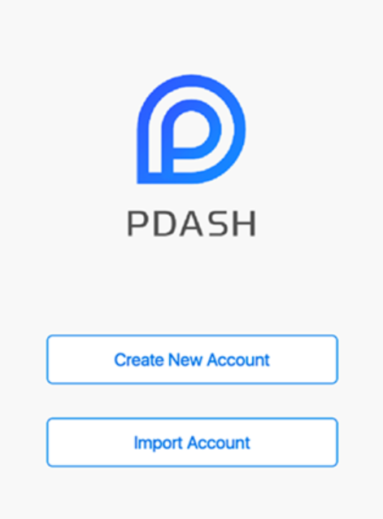
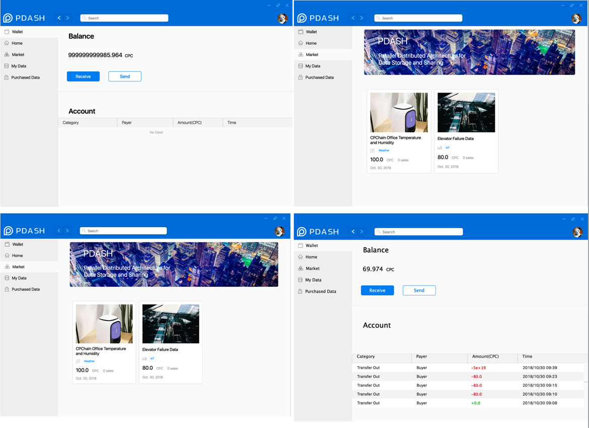
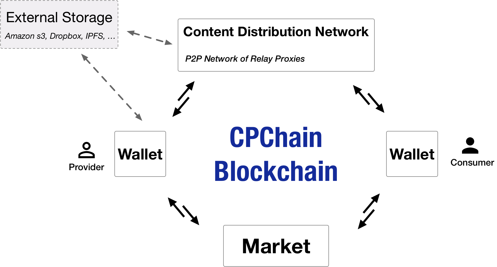
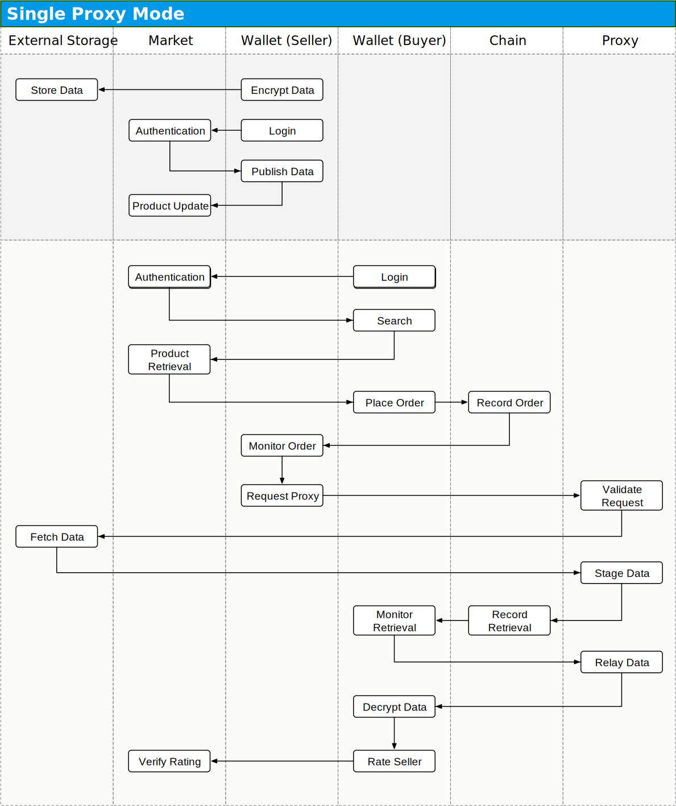
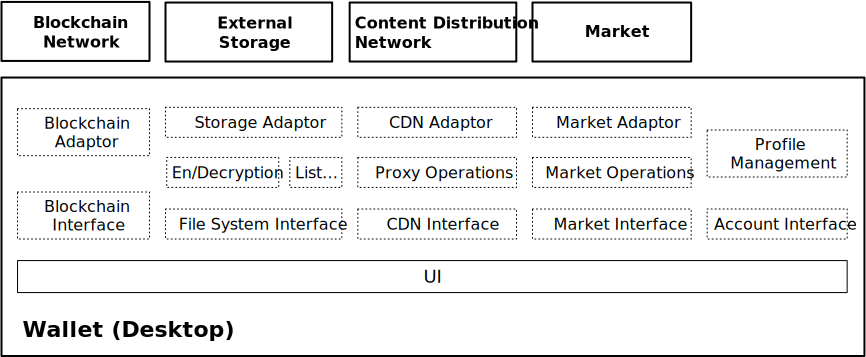
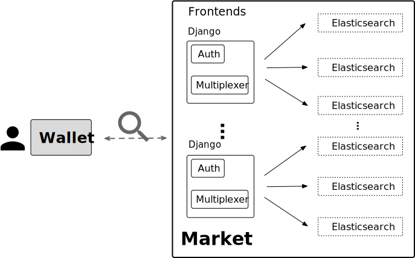
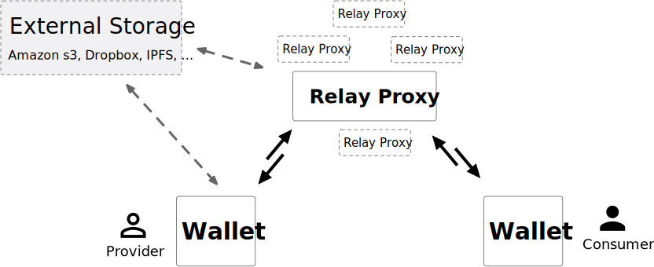
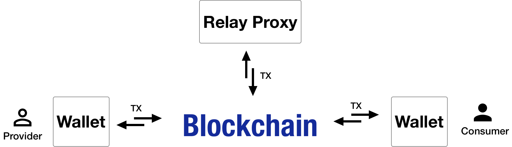

# PDash

PDash is a blockchain-based data sharing platform.

Visit us at [cpchain.io](http://cpchain.io/).

**Preview**






**Transaction Demo**

See the demo at [youtube](https://www.youtube.com/watch?v=L9nGxp9HbYE).


**Table of Contents**

- [Introduction](#introduction)
- [Architecture](#architecture)
- [Components](#components)
    - [Wallet](#wallet)
    - [Market](#market)
    - [Proxy](#proxy)
    - [Chain](#chain)
- [Deployment](#deployment)
    - [Prerequisites](#prerequisites)
    - [Chain deploy](#chain-deploy)
        - [Geth](#geth)
        - [Smart contract](#smart-contract)
        - [Charge server](#charge-server)
        - [Configuration](#chain-configuration)
    - [Market deploy](#market-deploy)
        - [Mysql database](#mysql-database)
        - [Django web service](#django-web-service)
        - [Elastic search](#elastic-search)
        - [Kibana](#kibana)
        - [Configuration](#market-configuration)
    - [Proxy deploy](#proxy-deploy)
        - [Configuration](#proxy-configuration)
        - [Kafka](#kafka)
        - [Tracker and Bootnode](#tracker-and-bootnode)
        - [Proxy node](#proxy-node)
    - [Wallet run](#wallet-run)
        - [Configuration](#wallet-configuration)
        - [QT Client](#QT-client)


# Introduction

PDash(Parallel Distributed Architecture for Data Storage and Sharing) is a new architecture for blockchain systems, which aims to solve the scalability bottleneck at the data level, and makes it possible for user to keep ownership of their own data as well as share data securely with economic feedback. PDash integrates decentralized blockchain network and distributed storage network to achieve secure data storage, validation and sharing, and utilizes multiple encryption technologies to enable efficient interaction between two parallel distributed networks.


# Architecture



# Components

The CPChain platform involves the following major components:

| Component                     | Functionality               |
|:------------------------------|:------------------------------|
| [Wallet](#wallet)            | Acts as the entrance to sharing data on CPChain.       |
| [Market](#market)       | Supports publishing/searching shared data.      |
| [Proxy](#proxy)        | Supports data relay and auditing.     |
| [Chain](#chain)        | Supports secure transaction.    |




## Wallet

Wallet is the sole frontend for sharing data. It operates in two modes: provider mode and consumer mode.

Provider mode assists users publishing their data, which invovles encrypting and storing data on the external storage, uploading data description to the market, communicating with the relay proxy for data transmission, etc.

Consumer mode assists users retrieving the desired data, which invovles browsing and searching on the market, initiating data transactions, fetching and decrypting data, etc.




## Market

Market connects the data provider with the consumer, bridging the information gap between them. The provider can describe self-owned data in a structured format, and publish the description to the market for profit. On the other hand, the consumer can freely query its interested data with natural language, and later initiate the corresponding retrieval order.



## Proxy

Proxy network consists of autonomous relay proxies. They form a DHT based peer-to-peer system, efficiently auditing transmission and relaying data to consumers.



## Chain

The blockchain is the core constituent of CPChain. It records critical transaction-related information, carries out smart contract operations for the participants, and serves as the immutable and irrefutable authority for post-mortem transaction inspection.



# Deployment

Follow the instructions below to deploy the Pdash to start your data sharing, enjoy it!

## Prerequisites

- git
- python3: 3.6+
- pip3
- docker engine (for proxy only): [install docker CE](https://store.docker.com/search?type=edition&offering=community)
- docker compose (for proxy only): [install docker compose](https://docs.docker.com/compose/install/)
- depended python packages
```
$ cd <Pdash dir>
$ pip3 install-deps.sh -r requirements.txt
```

## Chain deploy

### Geth

First of all, you need to run ethereum geth client.

```
$ cd <Pdash dir>/cpchain/bin
$ ./eth-init-chain
$ ./eth-run-geth
```

### Smart contract

```
$ cd scripts/chain/
$ python3 deploy.py

```

### Charge server

A faucet page is created to receive CPC for testing purpose.

```
cd bin
./charge-server
```

The password for accounts in genesis block is stored in 'eth/data_dir/keystore/password'.

### Chain configuration

Create your cpchain.toml under ~/.cpchain/ and add the following configuration into the file:
```
[chain]
mode = 'falcon'
falcon_provider_addr = "http://localhost:8545"

[account]
charge_server = 'http://192.168.0.132:8400'

```

## Market deploy

### Mysql database
Market uses mysql database, so we need to start mysql daemon first.

create mysql configuration file ~/.cpchain/.mysql_env as following:
```
MYSQL_ROOT_PASSWORD=<passwd>
MYSQL_DATABASE=<database name>
MYSQL_USER=<username>
MYSQL_PASSWORD=<passwd>
```

run mysql in docker
```
cd mysql
docker-compose up -d
```

### Django web service
Market is built on django + rest_framework infrastructure, so just start the django app as following:

```
python3 cpchain/market/manage.py makemigrations
python3 cpchain/market/manage.py migrate
python3 cpchain/market/manage.py runserver 0.0.0.0:8083
```

### Elastic search
- download and install elasticsearch-6.2.3
- start service with : /opt/elasticsearch-6.2.3/bin/elasticsearch -d
- access http://localhost:9200/market/ to verify it.

### Kibana
- download and install kibana-6.2.3-linux-x86_64
- start service with ：nohup /opt/kibana-6.2.3-linux-x86_64/bin/kibana >/dev/null 2>&1 &
- access http://localhost:5601/app/kibana#/home?_g=() to verify it.

### Market configuration
Add the following configuration into cpchain.toml:
```
[market]
market_url = "http://localhost:8083"
es_hosts = 'http://localhost:9200'
```

## Proxy deploy

### Proxy configuration

Add the following configuration into cpchain.toml:
```
[core]
mode = 'proxy'

[proxy]
boot_nodes = '127.0.0.1:8103'
tracker = '127.0.0.1:8201'
kafka_brokers = '127.0.0.1:29092'
```

### Kafka

PDash supports stream data transaction to meet the requirment of IOT data exchange. To achive this goal, kafka is introduced in proxy for stream providing and consuming.

```
$ cd bin
$ ./kafka-utils start
```

### Tracker and Bootnode

Proxy supports both master/slaves centralized network and DHT-based self-organized distributed network.

```
$ cd bin
$ ./proxy-first-node
```

### Proxy

```
$ cd bin
$ ./proxy-start
```

## Wallet run

### Wallet configuration

Add the following configuration into cpchain.toml:
```
[core]
mode = 'wallet'
```

### QT Client
```
$ cd bin
$ ./wallet
```
